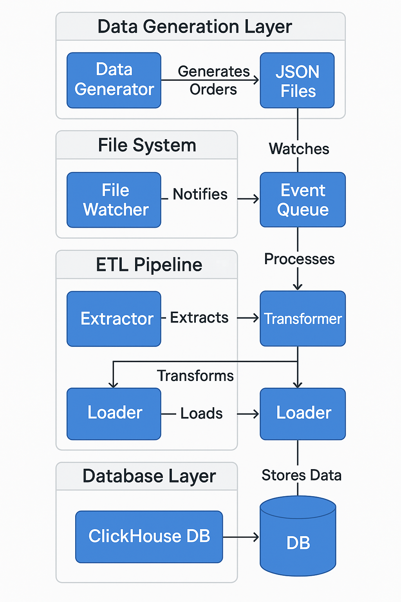

# Shopify ETL Project

This project implements an ETL pipeline to process Shopify order data and store it in ClickHouse for analytics.

## Project Structure
```
shopify_etl/
├── data/                   # Input data directory
├── src/                    # Source code
│   ├── models/            # Data models
│   ├── etl/               # ETL pipeline code
│   ├── database/          # Database related code
│   └── analytics/         # Analytics and metrics code
├── tests/                 # Test files
├── config/                # Configuration files
```

## Flow Diagram
The project's data flow is illustrated in the following diagram:


## Setup
1. Create a virtual environment:
```bash
python -m venv venv
source venv/bin/activate  # On Windows: venv\Scripts\activate
```

2. Install dependencies:
```bash
pip install -r requirements.txt
```

3. Set up environment variables:
Create a `.env` file in the root directory with:
```
CLICKHOUSE_HOST=127.0.0.1
CLICKHOUSE_PORT=9000
CLICKHOUSE_USER=default
CLICKHOUSE_PASSWORD=
CLICKHOUSE_DATABASE=default
```

## Database Schema

The project uses two main tables in ClickHouse for storing order data:

### Orders Table
```sql
CREATE TABLE orders (
    id UInt64,
    name String,
    email String,
    created_at DateTime,
    updated_at DateTime,
    processed_at DateTime,
    total_price Decimal(10,2),
    subtotal_price Decimal(10,2),
    total_tax Decimal(10,2),
    total_discounts Decimal(10,2),
    currency String,
    financial_status String,
    fulfillment_status String,
    customer_id UInt64,
    customer_email String,
    customer_first_name String,
    customer_last_name String,
    customer_phone String,
    billing_address_city String,
    billing_address_province String,
    billing_address_country String,
    shipping_address_city String,
    shipping_address_province String,
    shipping_address_country String,
    note String,
    tags String
) ENGINE = ReplacingMergeTree()
ORDER BY (id, created_at)
PRIMARY KEY id
```

### Order Items Table
```sql
CREATE TABLE order_items (
    id UInt64,
    order_id UInt64,
    name String,
    price Decimal(10,2),
    quantity UInt32,
    sku String,
    title String,
    variant_id UInt64,
    product_id UInt64,
    total_discount Decimal(10,2)
) ENGINE = ReplacingMergeTree()
ORDER BY (id, order_id)
PRIMARY KEY (id, order_id)


```

Both tables use the ReplacingMergeTree engine which allows for efficient handling of duplicate data and updates.

## Running the Project
1. Start ClickHouse server
2. Run the ETL pipeline:
```bash
python pipeline.py
```

## Development
- Use `black` for code formatting
- Use `isort` for import sorting
- Use `mypy` for type checking
- Write tests using `pytest` 
